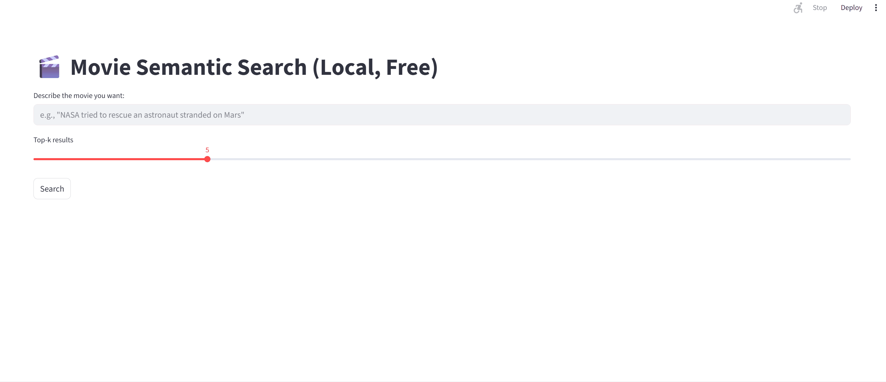

# Movie Semantic Search (Local)

A small local-only semantic search demo for movies.  
It encodes movie overviews into embeddings, builds a FAISS index, and returns the Top-K most similar movies for a user query.

This repo is meant for learning and for a reproducible GitHub project. No paid APIs, no deployment required.

---

## What you can do

- Build embeddings from a CSV dataset (one-time step)
- Create a FAISS index for fast similarity search
- Query from:
  - a CLI script
  - a local Streamlit web UI

---

## How it works (short version)

1. **Load & clean data**  
   Read `tmdb-movies.csv`, keep the minimal columns needed for search and display (title, overview, year, etc.).

2. **Embedding**  
   Use `sentence-transformers` (`all-MiniLM-L6-v2`) to convert each overview into a vector.  
   Vectors are **L2-normalized**.

3. **Indexing**  
   Build `faiss.IndexFlatIP`. With normalized vectors, **inner product ranking is equivalent to cosine similarity ranking**.

4. **Query**  
   Encode the query → FAISS `search()` → get Top-K indices → map indices back to rows in the metadata table.

---

## Repository layout

```text
data/
  tmdb-movies.csv                 # input data
src/                              # core modules (embedding, indexing, search)
scripts/
  build_assets.py                 # build embeddings + FAISS index (one-time)
  query_cli.py                    # CLI search
app_streamlit.py                  # local UI (optional)
requirements.txt

```
---


## Setup (Windows / VS Code)

### 1) Create and activate a virtual environment

PowerShell:
```bash
python -m venv .venv
.\.venv\Scripts\Activate.ps1
```

### 2) Install dependencies
```bash
pip install -r requirements.txt
```

### 3) Put the dataset in place

Download or place your data file:
```text
data/tmdb-movies.csv
```

---

## Build (one-time)
```bash
python scripts/build_assets.py
```

This will generate:
- `movie_embeddings.npy` – embeddings
- `faiss.index` – FAISS index
- `meta.parquet` – metadata table

---

## Usage

### CLI search
```bash
python scripts/query_cli.py --q "NASA tried to rescue an astronaut stranded on Mars" --k 5
```

### Local Streamlit UI
```bash
streamlit run app_streamlit.py
```

Then open `http://localhost:8501` in your browser.

---

## Notes (design choices)

- **Why `IndexFlatIP`?**  
  The dataset here is ~10k items, so an exact flat index is simple, reliable, and fast enough.

- **Why L2 normalization?**  
  After normalization, cosine similarity equals dot product, so `IndexFlatIP` can be used for cosine-style ranking.

---

## Reference

This project's learning path and overall approach were inspired by:  
https://hongtaoh.com/cn/2025/03/16/bert/

I implemented a local-only version and added a Streamlit demo for easier reproduction.

## Demo (Local Streamlit UI)



---

